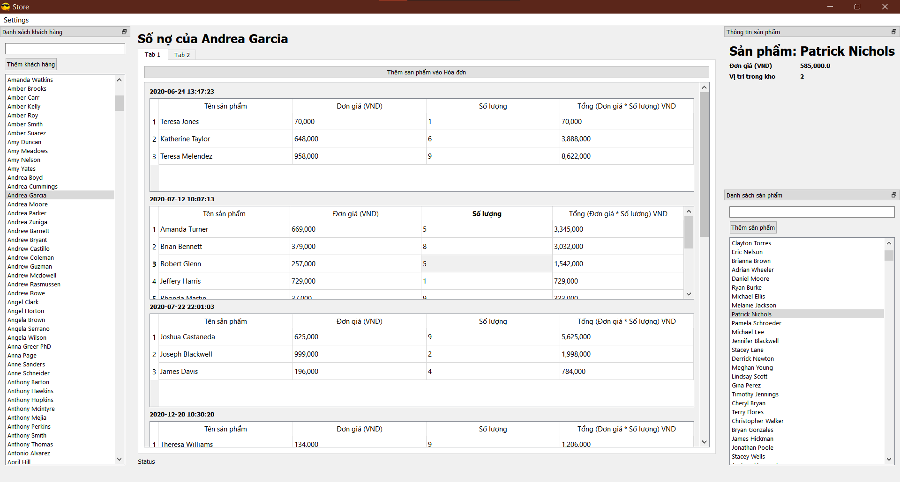

# Store Management for small bussiness

# Installing
## System Environment/Requirements
- Python 3.9.13
- Mysql 5.7.33

Create env for this project: `python -m venv env`

Activate env: 
- Windows: `.\env\Scripts\activate.bat` 

Install packages from requirements file: `pip install -r requirements.txt`

Database schematic in `\database\query\database_schematic.sql`

# Features

## Customer Management
- CRUD Customer
- Customer Invoices

## Product Management
- CRUD Product

## Invoices Management
- CRUD Invoices
- Tax/ Interest Rate